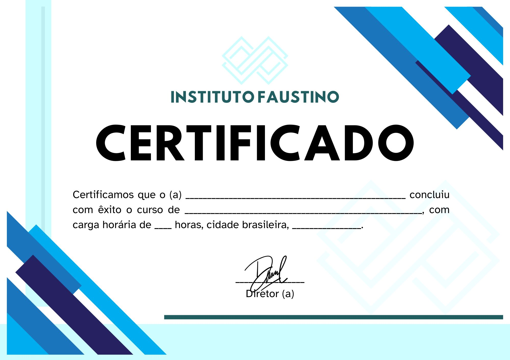

# 🏆 Gerador de Certificados a partir de Planilha Excel

Este script automatiza a geração de certificados personalizados a partir dos dados contidos em uma planilha `.xlsx`. Os certificados são preenchidos com informações como nome do participante, curso, tipo de participação, carga horária, datas, e são salvos como imagens `.jpg`.

---

## 📁 Estrutura do Projeto

```
/src
├── certificado_padrao.jpg          # Modelo base do certificado
├── fontes/
│   ├── tahoma.ttf                  # Fonte padrão
│   └── tahomabd.ttf                # Fonte em negrito
├── planilha_alunos.xlsx            # Planilha com os dados dos participantes
└── Certificados/                   # Pasta onde os certificados gerados serão salvos
app.py                              # Script principal
```

---

## ✅ Funcionalidades

- Leitura automática de dados da planilha Excel.
- Preenchimento dinâmico dos certificados com:
  - Nome do participante
  - Nome do curso
  - Tipo de participação
  - Carga horária
  - Datas de início, término e emissão
- Salvamento de cada certificado como imagem `.jpg` com o nome do participante.

---

## 📋 Pré-requisitos

- Python 3.8+
- Bibliotecas:
  - [`openpyxl`](https://pypi.org/project/openpyxl/)
  - [`Pillow`](https://pypi.org/project/Pillow/)

Você pode instalar as dependências com:

```bash
pip install openpyxl pillow
```

---

## 🚀 Como Usar

1. **Configure a planilha** `planilha_alunos.xlsx` com os seguintes dados a partir da linha 2:

| Nome do Curso | Nome do Participante | Tipo de Participação | Data Início | Data Final | Carga Horária | Data de Emissão |
|---------------|----------------------|-----------------------|-------------|------------|----------------|------------------|

2. **Tenha o certificado modelo** (`certificado_padrao.jpg`) e as **fontes** corretas na pasta `src`.

3. **Execute o script**:

```bash
python app.py
```

4. Os certificados gerados serão salvos na pasta `./src/Certificados/`.

---

## 📝 Observações

- Certifique-se de que os dados da planilha estejam corretos e no formato apropriado.
- As coordenadas dos textos no certificado podem precisar de ajustes conforme o modelo de imagem utilizado.

---

## 📌 Exemplo de Certificado Gerado

📸 

---

## 🔒 Licença

Este projeto é de uso livre para fins educacionais e não possui uma licença específica. Para uso comercial, adapte com responsabilidade.
